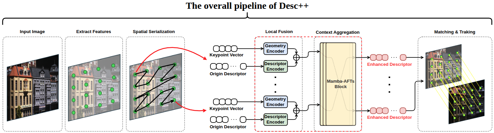

# Desc++
This is a PyTorch implementation of "Desc++: Efficient Context-Aware Feature Descriptor Enhancement for Robust Data Association in Visual SLAM."

> ⚠️ This repository is currently provided for review and demonstration purposes only. At this stage, we release the inference and demo code of Desc++, while the training code is being finalized and will be released upon paper acceptance.

<div align="center">
    <a href="https://anonymous0187.github.io/" style="background-color: #2ea44f; color: white; padding: 12px 24px; text-decoration: none; border-radius: 6px; font-weight: bold; font-family: -apple-system,BlinkMacSystemFont,Segoe UI,Helvetica,Arial,sans-serif; display: inline-block;">
        Project Homepage
    </a>
</div>

## Introduction
Desc++ is a plug-and-play descriptor enhancer that boosts matching performance and discriminative power. By seamlessly fusing raw descriptors with geometric priors, it generates high-quality representations within the original descriptor space, ensuring robust data association.

  
***
### 1. Installation
#### 💡 Requirements:
- **Linux**
- **NVIDIA GPU**  
- **PyTorch ≥ 1.12**
- **CUDA ≥ 11.6**

#### 1.1.  Install Desc++
```
git clone <REPOSITORY_URL> && cd DescPP
conda env create -f environment.yml
conda activate descpp_env
```

#### 1.2. Install Mamba
```
cd ..
git clone https://github.com/state-spaces/mamba && cd mamba
pip install .
```

#### 1.3. Install Extractor
Desc++ currently supports several mainstream feature extractors, including ORB, SIFT, SuperPoint, and ALIKE. To utilize these features within our enhancer, please follow the steps below:
* [ORB](https://github.com/raulmur/ORB_SLAM2) (ORB extractor of ORB-SLAM2)
    ```
    cd lib/orbslam2_features/
    mkdir build && cd build
    make -j
    cd ..
    ```
* [SIFT](https://github.com/colmap/pycolmap) (SIFT extractor of COLMAP v3.9.1)

* [SuperPoint](https://github.com/magicleap/SuperPointPretrainedNetwork)
    ```
    cd lib
    git clone https://github.com/magicleap/SuperPointPretrainedNetwork.git
    cd ..
    ```
* [ALIKE](https://github.com/Shiaoming/ALIKE) (ALIKE-L)
    ```
    cd lib
    git clone https://github.com/Shiaoming/ALIKE.git
    cd ..
    ```

## 2. Evaluation on HPatches 
#### 2.1. Download Dataset
```
cd hpatches-benchmarking
bash dataset.sh
cd ..
```

#### 2.2. Extract Features
```
# extract baseline features: ORB/SIFT/SuperPoint/ALIKE
python3 extract_features.py --feature ORB 

# extract baseline features with descriptor enhancement: DescPP_ORB/DescPP_SIFT/DescPP_SuperPoint/DescPP_ALIKE
python3 extract_features.py --feature ORB --model_path weights/DescPP_ORB.pt
```

#### 2.3. Evaluation
```
cd hpatches-benchmarking
python3 HPatches_Sequences_Matching_Benchmark.py 
```

## 3. Integrate into the Visual SLAM system
- In this work, we integrate Desc++ into several ORB-based SLAM frameworks, including [ORB-SLAM2](https://github.com/raulmur/ORB_SLAM2) (Stereo), [ORB-SLAM3](https://github.com/UZ-SLAMLab/ORB_SLAM3.git) (Stereo-Inertial), and [RGB-L](https://github.com/TUMFTM/ORB_SLAM3_RGBL.git) (Visual-LiDAR-Inertial). We utilize pybind11 to bridge the Python-based inference with the C++ SLAM backend.
- For ORB-SLAM, it is crucial to replace the official vocabulary with [our provided vocabulary file](Vocabulary/DescppVOC.zip) to ensure compatibility. Furthermore, the descriptor enhancement module should be inserted immediately following the feature extraction stage.

## 4. Training

#### Training Requirements:
> The code is currently under review and will be released soon.

If you want to train Desc++ on your own machine, we recommend:
- **≥ 128 GB system RAM**
- **≥ 24 GB GPU VRAM**
- **≥ 1.2 TB free disk space** for training data
Training on a single RTX 4090 takes about two days.
