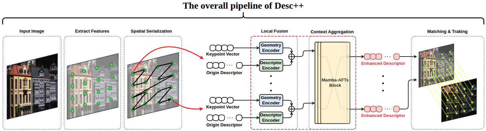

# Desc++
This is a PyTorch implementation of "Desc++: Efficient Descriptor Enhancement for Data Association in Existing Visual SLAM Systems."

<div align="center">
    <a href="https://ouotingwei.github.io/DescPP_website/" style="background-color: #2ea44f; color: white; padding: 12px 24px; text-decoration: none; border-radius: 6px; font-weight: bold; font-family: -apple-system,BlinkMacSystemFont,Segoe UI,Helvetica,Arial,sans-serif; display: inline-block;">
        Project Homepage
    </a>
</div>

# News
- **2026.09.18**: The optimized training code is now available.
- **2026.08.23**: Desc++ has been accepted as a **Late Breaking Result (LBR)** at **IROS 2026**, Pittsburgh, PA, USA.
- **2026.07.14**: Code and pretrained models are released.
- **2026.07.13**: Our paper is now available on [arXiv](https://arxiv.org/abs/2607.11099)!

## Introduction
Desc++ is a plug-and-play descriptor enhancer that boosts matching performance and discriminative power. By seamlessly fusing raw descriptors with geometric priors, it generates high-quality representations within the original descriptor space, ensuring robust data association.

  
***
### 1. Installation
#### 💡 Requirements:
- **Linux**
- **NVIDIA GPU**  
- **PyTorch ≥ 1.12**
- **CUDA ≥ 11.6**

#### 1.1.  Install Desc++
```
git clone <REPOSITORY_URL> && cd DescPP
conda env create -f environment.yml
conda activate descpp_env
```

#### 1.2. Install Mamba
```
cd ..
git clone https://github.com/state-spaces/mamba && cd mamba
pip install .
```

#### 1.3. Install Extractor
Desc++ currently supports several mainstream feature extractors, including ORB, SIFT, SuperPoint, and ALIKE. To utilize these features within our enhancer, please follow the steps below:
* [ORB](https://github.com/raulmur/ORB_SLAM2) (ORB extractor of ORB-SLAM2)
    ```
    cd lib/orbslam2_features/
    mkdir build && cd build
    make -j
    cd ..
    ```
* [SIFT](https://github.com/colmap/pycolmap) (SIFT extractor of COLMAP v3.9.1)

* [SuperPoint](https://github.com/magicleap/SuperPointPretrainedNetwork)
    ```
    cd lib
    git clone https://github.com/magicleap/SuperPointPretrainedNetwork.git
    cd ..
    ```
* [ALIKE](https://github.com/Shiaoming/ALIKE) (ALIKE-L)
    ```
    cd lib
    git clone https://github.com/Shiaoming/ALIKE.git
    cd ..
    ```

## 2. Evaluation on HPatches 
#### 2.1. Download Dataset
```
cd hpatches-benchmarking
bash dataset.sh
cd ..
```

#### 2.2. Extract Features
```
# extract baseline features: ORB/SIFT/SuperPoint/ALIKE
python3 extract_features.py --feature ORB 

# extract baseline features with descriptor enhancement: DescPP_ORB/DescPP_SIFT/DescPP_SuperPoint/DescPP_ALIKE
python3 extract_features.py --feature ORB --model_path weights/DescPP_ORB.pt
```

#### 2.3. Evaluation
```
cd hpatches-benchmarking
python3 HPatches_Sequences_Matching_Benchmark.py 
```

## 3. Integrate into the Visual SLAM system
- In this work, we integrate Desc++ into several ORB-based SLAM frameworks, including [ORB-SLAM2](https://github.com/raulmur/ORB_SLAM2) (Stereo), [ORB-SLAM3](https://github.com/UZ-SLAMLab/ORB_SLAM3.git) (Stereo-Inertial), [RGB-L](https://github.com/TUMFTM/ORB_SLAM3_RGBL.git) (Visual-LiDAR-Inertial), and [MAVIS-SLAM](https://github.com/MAVIS-SLAM/OpenMAVIS.git) (Multi Camea-Inertial). We utilize pybind11 to bridge the Python-based inference with the C++ SLAM backend.
- For ORB-SLAM, it is crucial to replace the official vocabulary with [our provided vocabulary file](Vocabulary/DescppVOC.zip) to ensure compatibility. Furthermore, the descriptor enhancement module should be inserted immediately following the feature extraction stage.

## 4. Training

### 4.1 Hardware Requirements
We recommend the following setup for training:

| Resource | Recommended |
|---|---|
| System RAM | ≥ 16 GB |
| GPU VRAM | ≥ 24 GB |
| Disk space | ≥ 1.2 TB (MegaDepth) |

Training one model for 50 epochs takes about two days on a single NVIDIA RTX 4090.

### 4.2 Data Preparation
1. Download the [MegaDepth](https://www.cs.cornell.edu/projects/megadepth/) dataset and preprocess it following [FeatureBooster](https://github.com/SJTU-ViSYS/FeatureBooster).
2. Set the dataset paths in `config/train_config.yaml`:
```yaml
   paths:
     scene_info_path: /path/to/MegaDepth/preprocessing
     base_path: /path/to/MegaDepth
```

### 4.3 Train
Select the feature with `--feature`:
```bash
python train_descpp.py --feature orb
python train_descpp.py --feature sift
python train_descpp.py --feature superpoint
python train_descpp.py --feature alike
```

Common options:
```bash
python train_descpp.py --feature orb --batch-size 8 --epochs 30 --lr 5e-4
python train_descpp.py --feature orb --run-val                         # enable validation
python train_descpp.py --feature orb --resume runs/DescPP_orb/last.pt  # resume training
```

All other settings (data sampling, loss, and per-feature model configuration) are defined in `config/train_config.yaml`.

### 4.4 Outputs
Results are saved to `runs/DescPP_<feature>/`:
- `model_epoch_XXX.pt`: model weights after each epoch
- `last.pt`: full training state for resuming
- `train_log.csv`, `step_log.csv`: per-epoch and per-step training logs
- `config.yaml`: the resolved configuration of the run

## Citation
If you find this work useful in your research, please consider citing:

```bibtex
@article{ou2026descpp,
  title   = {{Desc++}: Efficient Descriptor Enhancement for Data Association in Existing Visual {SLAM} Systems},
  author  = {Ou, Ting-Wei and Lin, Huang-Ting and Young, Kuu-Young},
  journal = {arXiv preprint arXiv:2607.11099},
  year    = {2026}
}
```

## Acknowledgement
This work builds upon several excellent open-source projects and prior works. We thank the authors for making their code publicly available:

- [FeatureBooster](https://github.com/SJTU-ViSYS/FeatureBooster): training pipeline and data preprocessing
- [Mamba](https://github.com/state-spaces/mamba): selective state space model
- [Learnable Fourier Features](https://arxiv.org/abs/2106.02795): keypoint geometric encoding
- [ORB-SLAM2](https://github.com/raulmur/ORB_SLAM2) and [ORB-SLAM3](https://github.com/UZ-SLAMLab/ORB_SLAM3): ORB feature extraction and SLAM evaluation
- [RGB-L](https://github.com/TUMFTM/ORB_SLAM3_RGBL): visual-LiDAR SLAM evaluation
- [MAVIS](https://github.com/MAVIS-SLAM/ORB_SLAM3_MULTI): multi-camera visual-inertial SLAM evaluation
